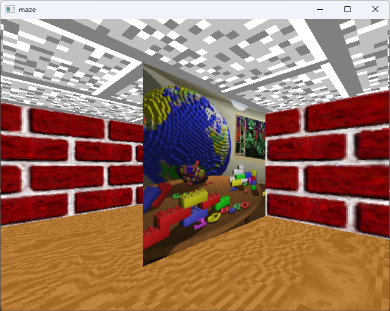

# 3dmaze



This project aims to port the source code of the 3D Maze screensaver seen in Windows 9x over to multiple platforms:

| Platform       | Status                                                |
|------------------------------------------------------------------------|
| Windows (SDL2) | Ported                                                |
| Linux (SDL2)   | Untested                                              |
| Nintendo DS    | In progress                                           |

Along with some additional objectives:
* Make the maze playable

## Third party libraries used
* stb_image
* freeglut

## Compiling

### For SDL2:
* Install the SDL2 and freeglut dependencies through a terminal with your package manager
* Build with cmake:
```
mkdir build
cd build
cmake ..
make
```

### For Nintendo DS:
* Install the [BlocksDS](https://blocksds.skylyrac.net/docs/setup/options/) SDK
* Build with `make`
* Copy the "data" folder to the root of the SD card.
